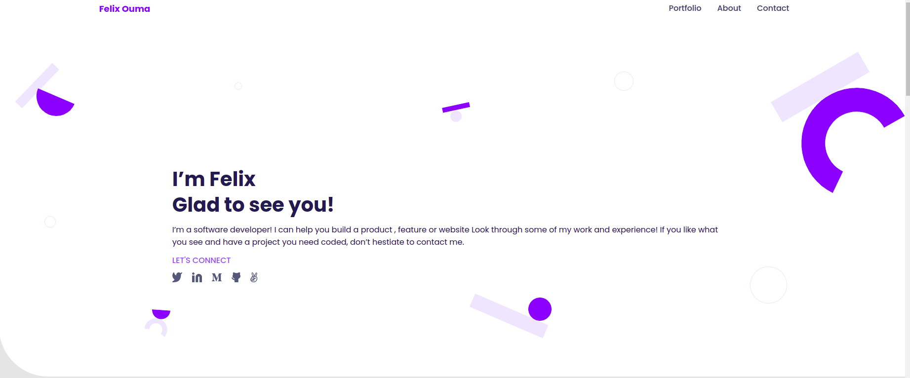

# My Portfolio

> This is my professional portfolio outlining previous projects




## Built With

- HTML
- CSS
- JavaScript


## Live Demo

[Live Demo Link](https://felix45.github.io/portfolio/)


## Getting Started

To get a local copy up and running follow these simple example steps.

### Prerequisites
```
  node js
  npm

```
### Setup
Clone the repository and change the directory to portfolio

``` 
  $ git clone git@github.com:Felix45/portfolio.git

  $ cd portfolio

```

### Install
Install all project dependencies by running the command below
 
``` 
  $ npm install
```
### Usage
Start the http application server
``` 
  $ http-server
```

### Deployment
- [Visit Application Homepage](http://localhost:8080)


### Authors

| 👤 Name | Github | Twitter | LinkedIn |
|:------|:--------|:---------|:----------|
|Felix Ouma|[@Felix45](https://github.com/Felix45)|[@Felix_Atonoh](https://twitter.com/Felix_Atonoh)|[LinkedIn](https://www.linkedin.com/in/felix-ouma-639766b0/)|
|Tasnimul Hassan|[@tasnimulhasan07](https://github.com/tasnimulhasan07)|[@tasnimulhasan07](https://twitter.com/tasnimulhasan07)|[LinkedIn](https://www.linkedin.com/in/tasnimulhasan07)|
|Dennis Mugiira|[@Mugiira-Kim](https://github.com/Mugiira-Kim)|[@BbmCru](https://twitter.com/BbmCru)|[LinkedIn](https://www.linkedin.com/in/mugiira-kim/) |
|Hanningtone Machuka|[@HanningtoneM](https://github.com/HanningtoneM)| |


## 🤝 Contributing

Contributions, issues, and feature requests are welcome!

Feel free to check the [issues page](https://github.com/Felix45/portfolio/issues).

## Show your support

Give a ⭐️ if you like this project!

## Acknowledgments

- Hat tip to [Microverse](https://bit.ly/MicroverseTN) for giving me this project to work on and [Figma](https://www.figma.com/file/l7SqJ3ZfkAKih9sFxvWSR4/Microverse-Student-Project-1), for using their design.

## 📝 License

This project is [MIT](https://github.com/git/git-scm.com/blob/main/MIT-LICENSE.txt) licensed.
